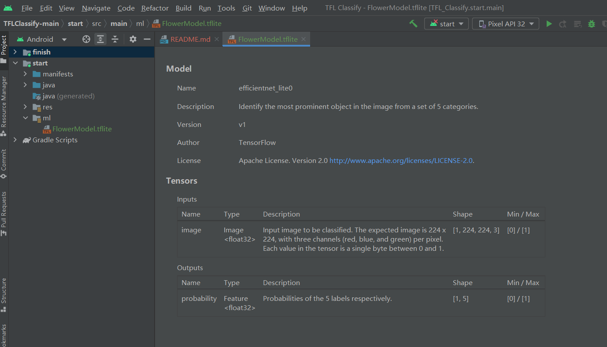
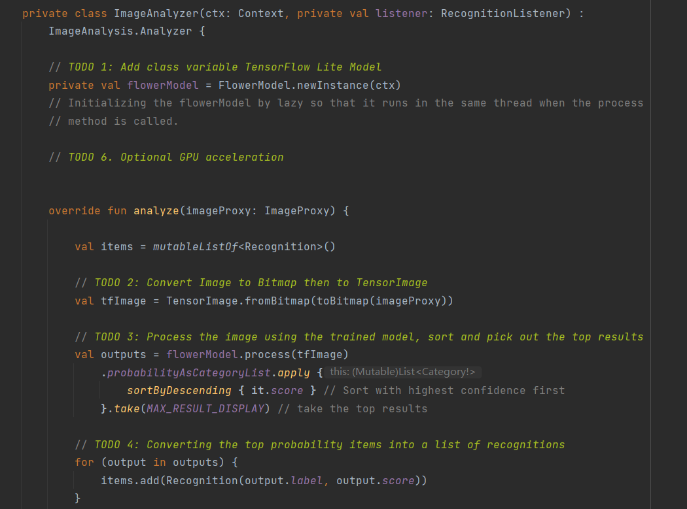
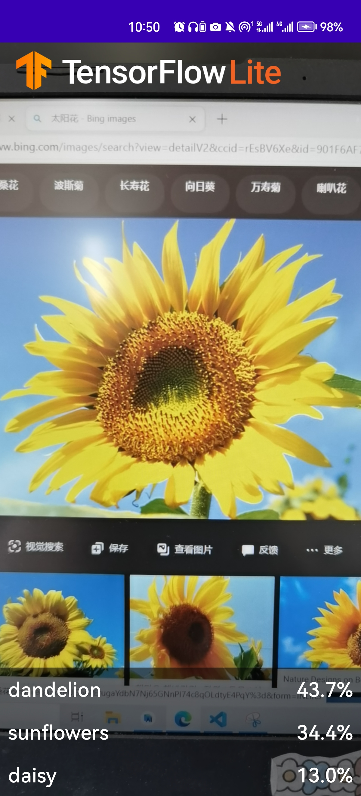
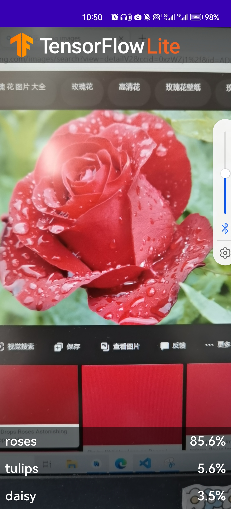

# 实验四：Android花卉识别应用 #

## 1.下载初始代码并运行
在git上下载TFLClassify。其中包含两个模块：start、finish。finish中为已完成块，start为待完成模块。  
使用androidstudio载入该项目，并建立依赖：
  

## 2.向应用中添加TensorFlow Lite  
①在start中添加，选中start，右击然后New>Other>TensorFlow Lite Mode  
②选择finish中已经编辑好的TensorFlow训练模型：FlowerModel.tflite，载入并且自动创建依赖   
③TensorFlow Lite模型被成功导入
  

## 3.检查TODO模块
本项目代码中包括了若干的TODO项，以导航项目中未完成之处。为了方便起见  
查看项目TODO列表视图，View>Tool Windows>TODO，并且按照模块分组：
  

# 4.添加编写TODO模块  
①TODO1:添加初始化训练模型的代码
```
private class ImageAnalyzer(ctx: Context, private val listener: RecognitionListener) :
        ImageAnalysis.Analyzer {

  ...
  // TODO 1: Add class variable TensorFlow Lite Model
  private val flowerModel = FlowerModel.newInstance(ctx)

  ...
}
```
②TODO2:在CameraX的analyze方法内部，将摄像头的输入ImageProxy转化为Bitmap对象，并进一步转化为TensorImage 对象
```
override fun analyze(imageProxy: ImageProxy) {
  ...
  // TODO 2: Convert Image to Bitmap then to TensorImage
  val tfImage = TensorImage.fromBitmap(toBitmap(imageProxy))
  ...
}

```  
③TODO3:对图像进行处理并生成结果:先按照属性score对识别结果按照概率从高到低排序；再列出最高k种可能的结果，k的结果由常量MAX_RESULT_DISPLAY定义
```
override fun analyze(imageProxy: ImageProxy) {
  ...
  // TODO 3: Process the image using the trained model, sort and pick out the top results
  val outputs = flowerModel.process(tfImage)
      .probabilityAsCategoryList.apply {
          sortByDescending { it.score } // Sort with highest confidence first
      }.take(MAX_RESULT_DISPLAY) // take the top results

  ...
}
```  
④TODO4:将识别的结果加入数据对象Recognition 中，包含label和score两个元素。后续将用于RecyclerView的数据显示
```
override fun analyze(imageProxy: ImageProxy) {
  ...
  // TODO 4: Converting the top probability items into a list of recognitions
  for (output in outputs) {
      items.add(Recognition(output.label, output.score))
  }
  ...
}
```
⑤TODO5:注释掉原有的识别结果代码
```
         //for (i in 0 until MAX_RESULT_DISPLAY){
            //    items.add(Recognition("Fake label $i", Random.nextFloat()))
            //}
```
最后如下：
  

# 5.连接物理机
物理机打开开发者模式，启用USB调试，与电脑间连接为文件传输

  

# 6.运行测试TensorFlow
识别花卉

